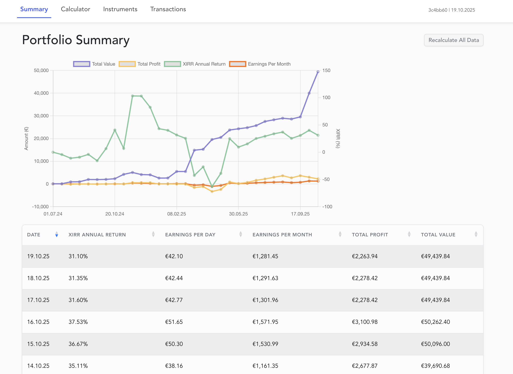

# Portfolio Management System

[](https://github.com/ktenman/portfolio/actions/workflows/ci.yml)
[](https://github.com/ktenman/portfolio/actions/workflows/trivy-scan.yml)

A full-stack application for managing investment portfolios with automated market data retrieval and performance analytics.



## Features

- **Portfolio Tracking**: Manage instruments (stocks, ETFs, crypto) and transactions across multiple platforms
- **Performance Analytics**: XIRR calculations, daily earnings, and profit tracking
- **Multi-Provider Data Sync**: Binance, Financial Times, Trading212, WisdomTree, Lightyear
- **Real-time Updates**: Scheduled jobs for automated price fetching
- **OAuth Authentication**: Google and GitHub login with session management
- **Public Calculator**: Standalone XIRR calculator at calculator.fov.ee

## Tech Stack

| Layer          | Technologies                                    |
| -------------- | ----------------------------------------------- |
| Backend        | Kotlin 2.2, Spring Boot 3.5, Java 21            |
| Frontend       | Vue.js 3.5, TypeScript 5.8, Vite 6, Bootstrap 5 |
| Database       | PostgreSQL 17, Flyway migrations                |
| Cache          | Redis 8                                         |
| Testing        | Atrium, JUnit 5, Vitest, Selenide               |
| Infrastructure | Docker, Caddy, GitHub Actions                   |

## Architecture

The system follows a microservices architecture:

- **Frontend**: Vue.js SPA served by Nginx
- **Backend API**: Spring Boot REST API
- **Auth Service**: OAuth 2.0 proxy for Google/GitHub login
- **Database**: PostgreSQL with optimized indexes
- **Cache**: Redis for sessions and data caching
- **Object Storage**: MinIO for logos
- **Reverse Proxy**: Caddy with SSL and routing


**External Integrations:**

- Market Data: Binance (crypto), FT Markets (HTML scraping)
- AI Services: OpenRouter (sector classification), Google Cloud Vision (OCR)
- Cloudflare Bypass Proxy: curl-impersonate for TLS fingerprint spoofing

Architecture diagrams are in `docs/architecture/` (PlantUML format).

## Quick Start

### Prerequisites

- Java 21, Node.js 22+, Docker

### Development Setup

```bash
# Start infrastructure
docker-compose -f compose.yaml up -d

# Run backend and frontend
./run.sh
```

Or manually:

```bash
# Backend (port 8081)
./gradlew bootRun

# Frontend (port 61234)
npm install && npm run dev
```

### Environment Variables

Copy `.env.local.example` to `.env` and configure:

```bash
POSTGRES_USER=postgres
POSTGRES_PASSWORD=your_password
GOOGLE_CLIENT_ID=your_client_id
GOOGLE_CLIENT_SECRET=your_secret
```

## Testing

```bash
# All tests
./test-runner.sh

# Backend only
./gradlew test

# Frontend only
npm test -- --run

# E2E tests
./test-runner.sh --e2e
```

## Production Deployment

```bash
docker-compose -f docker-compose.local.yml build
docker-compose -f docker-compose.local.yml up -d
```

## Known Issues

1. **Auth Divergence**: Development uses Keycloak, production uses custom auth service
2. **Market Tracker Stability**: Selenium scraper requires periodic restarts

## License

Apache License 2.0 - see [LICENSE](LICENSE) for details.
