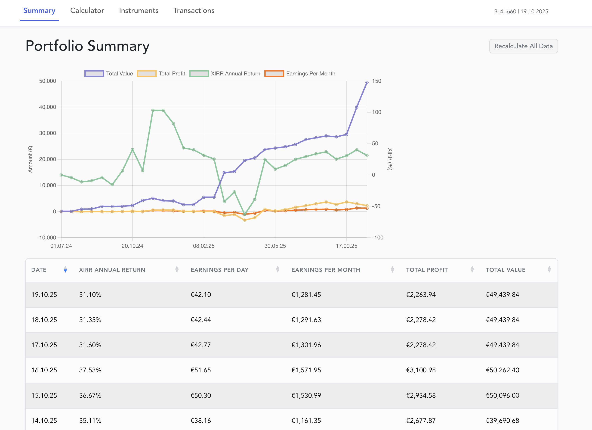
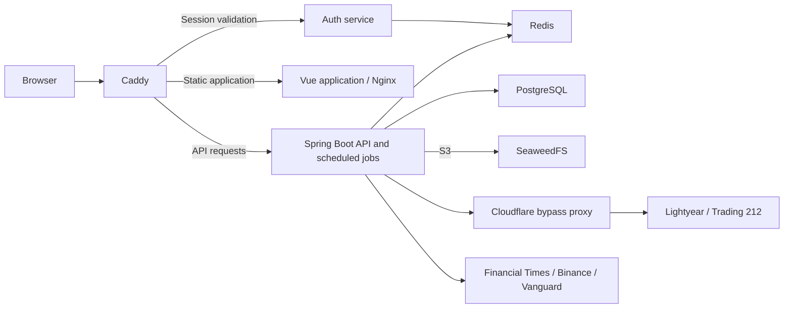

# Portfolio Management System

[](https://github.com/ktenman/portfolio/actions/workflows/ci.yml)
[](https://github.com/ktenman/portfolio/actions/workflows/trivy-scan.yml)

Track investments across brokers, review portfolio performance, and look through ETFs to their underlying holdings. The application combines a Kotlin/Spring Boot API with a Vue/TypeScript frontend, automated price retrieval, and XIRR calculations.



## Features

- **Portfolio history:** platform filters, daily and intraday charts, profit and earnings, annual and rolling XIRR windows, and comparisons against the S&P 500 and VWCE.
- **Instruments and transactions:** stocks, ETFs, cryptocurrencies, and cash; buy/sell records, commissions, realized and unrealized profit, date filters, and platform-specific holdings.
- **Broker coverage:** Aviva, Binance, LHV, Lightyear, Lightyear Business, Swedbank, and Trading 212.
- **ETF analysis:** underlying companies, sectors, industries, countries, and expense ratios. Holdings come from Vanguard, Lightyear, and Trading 212, with source provenance for classifications.
- **Diversification:** allocation planning against existing holdings and a portfolio comparison against VGLA.
- **Market data:** scheduled price retrieval from Financial Times, Binance, Lightyear, and Trading 212, plus historical gap filling and intraday price storage.
- **Calculator:** investment projections with XIRR, also exposed through the public calculator routes in [Caddyfile](Caddyfile).
- **Supporting services:** company logos in S3 storage, OpenRouter classification and logo selection, Google Cloud Vision OCR, Telegram notifications, and vehicle valuation integrations.

## Quick start

### Requirements

- Java 25; Gradle is provided by `./gradlew`.
- Node.js 24 and npm.
- Docker with Docker Compose. The Cloudflare proxy runs as a Linux AMD64 container, including on Apple Silicon.

Install dependencies and start the application from the repository root:

```bash
npm ci
npm run dev
```

The `predev` hook stops and removes **all Docker containers on the host**, stops processes listening on ports 8081 and 61234, and builds the Cloudflare proxy image. The development command then starts the backend and frontend. Spring Boot's Docker Compose support starts the services in [compose.yaml](compose.yaml): PostgreSQL, Redis, SeaweedFS, and the Cloudflare proxy.

| Service                 | Local address                         |
| ----------------------- | ------------------------------------- |
| Frontend                | http://localhost:61234                |
| Backend API             | http://localhost:8081/api             |
| Swagger UI              | http://localhost:8081/swagger-ui.html |
| OpenAPI JSON            | http://localhost:8081/api-docs        |
| Backend health          | http://localhost:8081/actuator/health |
| PostgreSQL              | `localhost:5432`                      |
| Redis                   | `localhost:6379`                      |
| SeaweedFS S3 endpoint   | http://localhost:9000                 |
| Cloudflare proxy health | http://localhost:3000/health          |

Vite proxies `/api` requests to the backend. This local development path connects directly to the API; the deployed application authenticates requests through Caddy and the auth service.

### Start processes separately

To manage infrastructure and application processes separately, build the proxy image and start the development services:

```bash
npm ci
npm run docker:build-proxy
npm run docker:up
npm run dev:backend
```

In another terminal:

```bash
npm run dev:ui
```

To start the backend without scheduled imports and price updates:

```bash
SCHEDULING_ENABLED=false npm run dev:backend
```

`npm run docker:down` stops the development infrastructure. `npm run test:cleanup` also terminates running `bootRun` and Vite processes.

## Configuration

Backend defaults are in [application.yml](src/main/resources/application.yml). Development infrastructure has local database and storage credentials in [compose.yaml](compose.yaml). External services use the environment variables below.

| Variables                                                                           | Purpose                                                          |
| ----------------------------------------------------------------------------------- | ---------------------------------------------------------------- |
| `SPRING_DATASOURCE_URL`, `SPRING_DATASOURCE_USERNAME`, `SPRING_DATASOURCE_PASSWORD` | Override the backend database connection.                        |
| `SPRING_DATA_REDIS_HOST`, `SPRING_DATA_REDIS_PORT`                                  | Override the backend Redis connection.                           |
| `MINIO_ENDPOINT`, `MINIO_ACCESS_KEY`, `MINIO_SECRET_KEY`, `MINIO_BUCKET_NAME`       | Backend S3 connection and logo bucket.                           |
| `MINIO_ROOT_USER`, `MINIO_ROOT_PASSWORD`                                            | SeaweedFS credentials used by the Compose stacks.                |
| `OPENROUTER_API_KEY`                                                                | Enable model-backed classification and logo selection.           |
| `GOOGLE_VISION_API_KEY`                                                             | Enable Google Cloud Vision OCR.                                  |
| `TRADING212_API_KEY_ID`, `TRADING212_API_KEY_SECRET`                                | Trading 212 API authentication for integrations that use it.     |
| `TELEGRAM_BOT_ENABLED`, `TELEGRAM_BOT_TOKEN`                                        | Enable and configure Telegram notifications.                     |
| `SCHEDULING_ENABLED`                                                                | Enable or disable scheduled jobs; defaults to `true`.            |
| `CLOUDFLARE_BYPASS_PROXY_URL`                                                       | Override the proxy address; defaults to `http://localhost:3000`. |

The storage service is **SeaweedFS**. The `MINIO_*` names remain for configuration compatibility, and the backend continues to use the MinIO Java SDK to access its S3 endpoint. For a backend running on the host, use the host-accessible endpoint and matching access/secret keys.

[.env.local.example](.env.local.example) provides OAuth and storage settings for Compose-based setups. Docker Compose reads `.env` for interpolation; backend processes launched on the host receive configuration through their shell environment. OAuth deployment also uses `GOOGLE_CLIENT_ID`, `GOOGLE_CLIENT_SECRET`, `GITHUB_CLIENT_ID`, `GITHUB_CLIENT_SECRET`, and `ALLOWED_EMAILS`; see the Compose files for access-list and redirect settings.

## Technical stack

Versions are declared in [the Gradle version catalog](gradle/libs.versions.toml), [the Gradle wrapper](gradle/wrapper/gradle-wrapper.properties), and [package.json](package.json), with frontend resolutions in [package-lock.json](package-lock.json).

| Area                         | Technologies                                                                  |
| ---------------------------- | ----------------------------------------------------------------------------- |
| Backend                      | Kotlin 2.4, Spring Boot 4.1, Java 25, Gradle 9.7                              |
| Frontend                     | Vue 3.5, TypeScript 6.0, Vite 8, Tailwind CSS 4.3, Vue Router 5, Chart.js 4.5 |
| Client data and state        | TanStack Vue Query, VueUse                                                    |
| Persistence                  | PostgreSQL 17, Flyway, Spring Data JPA/Hibernate                              |
| Cache                        | Redis 8 and Spring Cache                                                      |
| Object storage               | SeaweedFS 4.47 with the MinIO Java SDK                                        |
| Proxy                        | Express 5, TypeScript, curl-impersonate, ONNX Runtime                         |
| Backend testing              | JUnit, Atrium, MockK, Kotest, ArchUnit, Testcontainers, WireMock, PITest      |
| Frontend and browser testing | Vitest, Vue Test Utils, Selenide, Playwright                                  |
| Delivery                     | GitHub Actions, Docker Compose, Caddy, Nginx                                  |

## Architecture


```mermaid
flowchart LR
    Browser --> Caddy
    Caddy -->|Session validation| Auth[Auth service]
    Caddy -->|Static application| Frontend[Vue application / Nginx]
    Caddy -->|API requests| Backend[Spring Boot API and scheduled jobs]
    Auth --> Redis
    Backend --> PostgreSQL
    Backend --> Redis
    Backend -->|S3| SeaweedFS
    Backend --> Proxy[Cloudflare bypass proxy]
    Proxy --> Brokers[Lightyear / Trading 212]
    Backend --> Providers[Financial Times / Binance / Vanguard]
```

The backend separates controllers, services, and repositories. Scheduled jobs update market data and holdings, calculate portfolio metrics, and clean up retained intraday data. Redis caches instruments, transactions, summaries, and ETF analysis; PostgreSQL stores the underlying records and historical prices.

In the deployed application, the browser sends session cookies to Caddy. Caddy asks the auth service's `/validate` endpoint to check the session and forwards authenticated requests with `X-User-Id`. Google and GitHub login routes are handled by the auth service. Calculator routes are public as configured in [Caddyfile](Caddyfile).

Additional PlantUML reference diagrams are in [docs/architecture](docs/architecture). Their SVGs can be regenerated with:

```bash
./scripts/generate-diagrams.sh
```

### Project layout

| Location                                                           | Contents                                                          |
| ------------------------------------------------------------------ | ----------------------------------------------------------------- |
| [src/main/kotlin](src/main/kotlin)                                 | Domain model, API, calculations, scheduled jobs, and integrations |
| [src/main/resources/db/migration](src/main/resources/db/migration) | Flyway schema and portfolio data migrations                       |
| [src/test/kotlin](src/test/kotlin)                                 | Backend unit, integration, architecture, and Selenide tests       |
| [ui](ui)                                                           | Vue components, composables, services, and Vitest tests           |
| [ui/tests/visual](ui/tests/visual)                                 | Playwright visual tests and deterministic fixtures                |
| [cloudflare-bypass-proxy](cloudflare-bypass-proxy)                 | Broker scraping proxy and captcha handling                        |
| [.github/workflows](.github/workflows)                             | CI, deployment, and security workflows                            |

## Development and testing

### Build and code quality

| Command                        | Purpose                                                                       |
| ------------------------------ | ----------------------------------------------------------------------------- |
| `./gradlew compileKotlin`      | Compile the backend and regenerate TypeScript DTOs.                           |
| `./gradlew bootJar`            | Build the executable backend JAR for deployment.                              |
| `npm run build`                | Type-check and build the frontend into `dist/`.                               |
| `npm run lint-format`          | Run TypeScript checks, ESLint, Prettier, Knip, ktlint formatting, and Detekt. |
| `./gradlew ktlintCheck detekt` | Check Kotlin style and static analysis.                                       |
| `npm run check-unused`         | Check unused frontend files, exports, and dependencies.                       |

TypeScript domain types are generated from Kotlin DTOs into `ui/models/generated/domain-models.ts`. Add DTOs to the generator's `classes` list in [build.gradle.kts](build.gradle.kts), then compile; do not edit the generated file manually.

Flyway runs on backend startup. Migrations include this portfolio's instruments and transaction history as well as schema changes. Name new migrations `VYYYYMMDDHHMM__description.sql` using the creation timestamp so they run after existing migrations. Put the actual trade date in `transaction_date` and leave previously applied migration files unchanged.

### Automated tests

| Command                                                | Scope                                                                       |
| ------------------------------------------------------ | --------------------------------------------------------------------------- |
| `./gradlew test`                                       | Backend unit and integration tests; excludes Selenide E2E tests by default. |
| `./gradlew test --tests '*DailySummaryCalculatorTest'` | A targeted backend test class.                                              |
| `npm test -- --run`                                    | All frontend tests without watch mode.                                      |
| `npm run test:coverage`                                | Frontend tests with coverage.                                               |
| `npm run test:proxy`                                   | Cloudflare proxy Jest tests.                                                |
| `npm run test:unit`                                    | Backend, frontend, and proxy tests.                                         |
| `npm run test:e2e`                                     | Start local services, run Selenide tests, and clean up.                     |
| `npm run test:all`                                     | Run `test:unit` followed by `test:e2e`.                                     |
| `./gradlew pitest`                                     | Backend mutation testing.                                                   |

Install the proxy's test dependencies before running its tests or the combined test commands:

```bash
npm ci --prefix cloudflare-bypass-proxy
```

Backend integration tests use Testcontainers for PostgreSQL, Redis, and SeaweedFS, with WireMock for external APIs. Docker must be running. Selenide E2E tests use Chrome/Chromium.

For manual E2E setup:

```bash
npm run test:setup
E2E=true ./gradlew test --info -Pheadless=true
npm run test:cleanup
```

The E2E scripts restart the local development services. Logs are written to `/tmp/portfolio-backend.log` and `/tmp/portfolio-frontend.log`. Backend test reports are under `build/reports/tests/test/`, JaCoCo coverage under `build/reports/jacoco/test/html/`, and frontend coverage under `coverage/`.

### Visual regression tests

Playwright checks desktop, tablet, and mobile layouts with zero pixel tolerance. The npm scripts use the same Linux ARM64 Playwright Docker image as CI:

```bash
npm run visual
npm run visual:update -- --grep "route summary"
```

Regenerate affected baselines after changes to rendered markup, styles, or data, and review the resulting images. Run `npm run lint-format` and `npm test -- --run` after frontend changes.

## Deployment and CI

The Compose configurations serve different purposes:

| File                                                             | Purpose                                                                        |
| ---------------------------------------------------------------- | ------------------------------------------------------------------------------ |
| [compose.yaml](compose.yaml)                                     | Infrastructure for backend and frontend processes running on the host.         |
| [docker-compose.yml](docker-compose.yml)                         | Production services using published application images, OAuth, and Caddy.      |
| [docker-compose.e2e-minimal.yml](docker-compose.e2e-minimal.yml) | Containerized backend, frontend, Nginx, and dependencies used by CI E2E tests. |
| [docker-compose.local.yml](docker-compose.local.yml)             | Alternate local container definitions, including auth and Caddy.               |

[The CI workflow](.github/workflows/ci.yml) runs on pull requests and pushes to `main`. It checks formatting and static analysis, backend and frontend tests, proxy tests, Selenide E2E tests, and Playwright visual baselines. Successful main-branch runs build changed application images for Docker Hub and GHCR and invoke [the deployment workflow](.github/workflows/deploy-pipeline.yml). Manual workflow dispatch can also build images and optionally deploy.

Production deployment creates its `.env` from GitHub secrets, pulls images, restarts services, and verifies container health. It requires the prepared `portfolio_seaweedfs_data` volume with the `.portfolio-storage-ready` marker from the storage cutover. PostgreSQL and SeaweedFS data are stored in persistent Docker volumes.

For an already configured production host, the underlying Compose commands are:

```bash
docker compose -f docker-compose.yml config --quiet
docker compose -f docker-compose.yml pull
docker compose -f docker-compose.yml up -d
```

The production Compose file and Caddy configuration target `fov.ee`; review their hostnames, access settings, and environment variables when deploying elsewhere.

[CodeQL](.github/workflows/codeql.yml) provides code scanning. [Trivy](.github/workflows/trivy-scan.yml) scans the published backend and frontend images on Mondays at 02:00 UTC and on manual dispatch, uploads security findings, and generates SBOM artifacts. Dependabot maintains dependency update PRs.

## Monitoring

- Backend health: `/actuator/health`; build details: `/api/build-info`.
- Cloudflare proxy health: `/health` on its service port.
- Redis cache names and expiration times: [RedisConfiguration.kt](src/main/kotlin/ee/tenman/portfolio/configuration/RedisConfiguration.kt).
- Scheduled job intervals and retention settings: [application.yml](src/main/resources/application.yml) and the [job implementations](src/main/kotlin/ee/tenman/portfolio/job).
- Production PostgreSQL enables `pg_stat_statements` and `auto_explain`. Statements over 500 ms are logged; those over one second include plans with actual row counts. Logs persist under `$PGDATA/log` and rotate weekly by filename.

On the production host:

```bash
docker exec postgres sh -c 'psql -U "$POSTGRES_USER" -d portfolio -c "SELECT calls, round(mean_exec_time) AS mean_ms, round(max_exec_time) AS max_ms, left(query, 100) AS query FROM pg_stat_statements ORDER BY max_exec_time DESC LIMIT 20"'
docker exec postgres sh -c 'tail -n 100 "$PGDATA"/log/postgresql-*.log'
```

## Contributing

Follow [AGENTS.md](AGENTS.md) and the applicable backend, frontend, or proxy guidance. Use issue-based `feature/<issue-number>-<description>` or `fix/<issue-number>-<description>` branches. Keep changes focused, verify the affected behavior, and include a summary and test plan in the pull request. CI must pass before review.

## License

Licensed under the Apache License 2.0. See [LICENSE](LICENSE).
