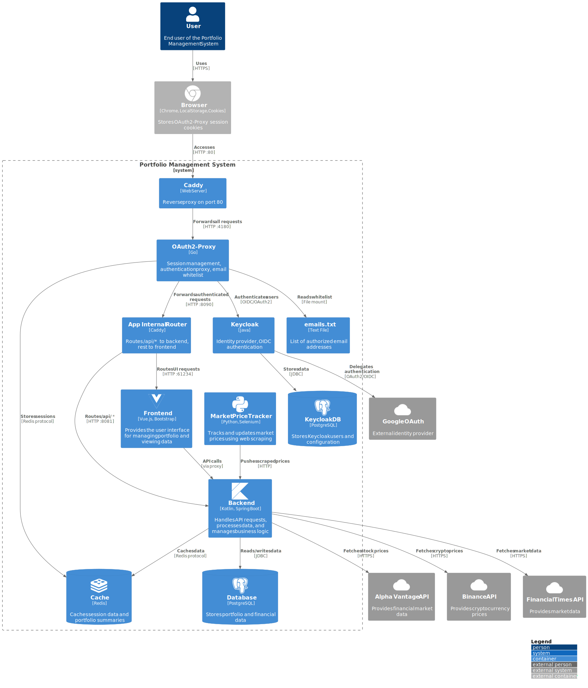

# Portfolio Management System

[](https://github.com/ktenman/portfolio/actions/workflows/ci.yml)
[](https://github.com/ktenman/portfolio/actions/workflows/trivy-scan.yml)

## Introduction

The Portfolio Management System is a comprehensive application designed to help users manage their investment
portfolios. It retrieves financial data from the Alpha Vantage API, stores it in a database, and provides a
user-friendly interface for viewing and managing portfolio transactions, instruments, and performance metrics.


## Key Features

- **Instrument Management**: Add, update, and delete financial instruments (stocks, ETFs, cryptocurrencies)
- **Transaction Tracking**: Record buy and sell transactions across multiple trading platforms
- **Performance Metrics**: Calculate portfolio performance with XIRR, daily earnings, and profit tracking
- **Multi-Provider Data Sync**: Fetch data from Alpha Vantage (stocks/ETFs), Binance (crypto), and Financial Times
- **Advanced Caching**: Redis-based caching with Spring Cache annotations for optimal performance
- **Real-time Market Tracker**: Selenium-based price scraping with automatic captcha solving
- **OAuth 2.0 Authentication**: Secure login via Google and GitHub with session management
- **Responsive UI**: Vue.js 3 SPA with Bootstrap 5 for desktop and mobile
- **Automated Jobs**: Scheduled tasks for price updates and portfolio calculations
- **Telegram Bot Integration**: Notifications and alerts via Telegram
- **Public Calculator**: Standalone XIRR calculator available at calculator.fov.ee

## Technical Stack

### Backend

- Spring Boot v3.5.0
- Spring Cloud v2025.0.0 (Northfields)
- Kotlin v2.1.21
- Java v21

### Frontend

- Vue.js v3.5.16
- TypeScript v5.8.3
- Bootstrap v5.3.5
- Vite v6.3.5
- Vue Router v4.5.1
- Chart.js v4.4.9

### Database & Caching

- PostgreSQL v17 with Flyway migrations
- Redis v8 for caching
- Spring Data JPA with Hibernate

### Testing

- JUnit 5 with Spring Boot Test
- Mockito Kotlin v5.4.0
- AssertJ for fluent assertions
- Selenide v7.9.3 for E2E tests
- Testcontainers for integration tests
- WireMock for API mocking
- Vitest v3.2.4 for Vue component testing
- Vue Test Utils for component mounting
- Comprehensive test coverage focusing on business logic

### CI/CD & Containerization

- GitHub Actions for CI/CD pipeline
- Docker with multi-stage builds
- Docker Compose for orchestration
- Caddy v2.10 as reverse proxy
- Nginx for frontend serving

### API Integration

- Alpha Vantage API for stock/ETF data
- Binance API for cryptocurrency prices
- Financial Times API for market data
- Google Cloud Vision API for OCR/captcha solving
- Telegram Bot API for notifications

### Market Price Tracker

- Python with Flask
- Selenium WebDriver for web scraping
- Automated captcha solving integration
- Scheduled price fetching every 3 minutes
- Health monitoring and auto-restart

## Architecture 🏗️



The system follows a microservices architecture with these components:

- **Frontend**: Vue.js 3 SPA served by Nginx
- **Backend API**: Spring Boot REST API with comprehensive business logic
- **Authentication Service**: OAuth 2.0 proxy handling Google/GitHub login
- **Database**: PostgreSQL 17 with optimized indexes and constraints
- **Cache**: Redis 8 for session storage and data caching
- **Market Price Tracker**: Python service for real-time price updates
- **Captcha Solver**: ML-based service for automated captcha resolution
- **Reverse Proxy**: Caddy handling SSL, routing, and authentication
- **Scheduled Jobs**: Background tasks for price updates and XIRR calculations

### Database 🗄️

PostgreSQL stores portfolio data, including instruments, transactions, and daily price information. The backend performs
CRUD operations using Spring Data JPA.

### Cache 🚀

Redis serves as a caching layer to improve data retrieval performance, storing frequently accessed data like instrument
details and portfolio summaries.

### Scheduled Jobs ⚙️

1. **Alpha Vantage Data Retrieval**: Fetches stock/ETF prices with rate limiting
2. **Binance Data Retrieval**: Updates cryptocurrency prices in real-time
3. **FT Data Retrieval**: Syncs Financial Times market data
4. **Daily Portfolio XIRR Job**: Calculates portfolio performance metrics
5. **Market Price Tracker**: Continuous web scraping with 3-minute intervals
6. **Cache Eviction**: Automatic cache cleanup for data consistency

### Authentication & Security 🔐

- OAuth 2.0 with Google and GitHub providers
- Session-based authentication with Redis storage
- Role-based access control with allowed email/login lists
- Caddy-based forward authentication
- HTTPS enforcement with automatic SSL certificates
- Security headers (HSTS, X-Frame-Options, CSP)

### Interaction Flow 📊

1. User logs in via the frontend.
2. Frontend redirects to OAuth service for authentication.
3. User is redirected back with an authentication token.
4. Frontend includes this token in backend requests.
5. Backend validates the token with the Auth service.
6. Frontend displays portfolio data to the user.
7. Periodic jobs update the database and calculate metrics.

## Setup and Running Instructions

### Prerequisites

- Java v21 (required for backend)
- Node.js v22+ and npm v10+ (required for frontend)
- Docker and Docker Compose (for containerized services)
- Gradle (included via wrapper)

### Local Development Setup

1. **Environment Variables**: Copy `.env.example` to `.env` and configure:

   ```bash
   cp .env.example .env
   ```

   Required variables:
   - `POSTGRES_USER` and `POSTGRES_PASSWORD`
   - `GOOGLE_CLIENT_ID` and `GOOGLE_CLIENT_SECRET` (for OAuth)
   - `VISION_BASE64_ENCODED_KEY` (for Google Cloud Vision)
   - `TELEGRAM_BOT_TOKEN` (optional, for Telegram integration)

2. **Start Infrastructure Services**:
   ```bash
   docker-compose -f compose.yaml up -d
   ```
   This starts PostgreSQL and Redis containers.

### Backend Setup

Navigate to the root directory and compile the Java application using Gradle:

```bash
./gradlew clean build
./gradlew bootRun
```

### Frontend Setup

Install frontend dependencies and start the development server:

```bash
npm install
npm run dev
```

You can access it in your web browser at http://localhost:61234

### Running and Updating the Application

To update the application or its services after making changes:

1. Rebuild the services:

```bash
docker-compose -f docker-compose.local.yml build
```

2. Restart the services for the changes to take effect:

```bash
docker-compose -f docker-compose.local.yml up -d
```

Once all services are running, access the application at:

- Main application: http://localhost
- Backend API: http://localhost:8081/api
- Frontend dev server: http://localhost:61234

### Production Deployment with Docker

For a full production-like setup locally:

```bash
# Build all services
docker-compose -f docker-compose.local.yml build

# Start the complete stack
docker-compose -f docker-compose.local.yml up -d
```

This includes all services: backend, frontend, auth, market tracker, and captcha solver.

### End-to-End Tests

To run end-to-end tests:

```bash
docker-compose -f docker-compose.yml -f docker-compose.e2e.yml down
docker volume rm portfolio_postgres_data_e2e
docker-compose -f docker-compose.yml -f docker-compose.e2e.yml up -d && sleep 30
export E2E=true && ./gradlew test --info -Pheadless=true
```

### Testing

**Backend Unit and Integration Tests:**

```bash
./gradlew test
```

**Run Specific Backend Test:**

```bash
./gradlew test --tests "PortfolioSummaryServiceTest"
```

**Backend Test Coverage Report:**

```bash
./gradlew jacocoTestReport
# Report available at: build/reports/jacoco/test/html/index.html
```

**Frontend Tests:**

```bash
npm test                    # Run all UI tests in watch mode
npm test -- --run           # Run tests once (no watch mode)
npm test -- --coverage      # Run tests with coverage report
```

**Unified Test Runner:**

```bash
./test-runner.sh            # Run all tests (unit + E2E)
./test-runner.sh --unit     # Run only unit tests
./test-runner.sh --e2e      # Run only E2E tests
```

### Continuous Integration

- GitHub Actions workflow runs on every push and PR
- Automated testing includes unit, integration, and E2E tests
- Dependabot manages dependency updates
- Docker images are built and pushed to Docker Hub on successful builds
- Trivy security scanning runs automatically after Docker image builds
- Daily vulnerability scans to catch newly discovered CVEs

### Security Scanning

The project uses **Trivy** for automated container vulnerability scanning:

**Automatic Scanning:**

- Triggers after successful CI builds when images are pushed to DockerHub
- Daily scans at 2 AM UTC to catch new vulnerabilities
- Scans all three Docker images: backend, frontend, and market tracker

**Security Features:**

- Vulnerability detection for OS packages and application dependencies
- Secret scanning to detect hardcoded credentials
- SBOM (Software Bill of Materials) generation
- Integration with GitHub Security tab for vulnerability tracking
- Automatic issue creation for critical vulnerabilities

**Manual Scanning:**

```bash
# Scan a specific image locally
docker run --rm -v /var/run/docker.sock:/var/run/docker.sock \
  aquasec/trivy image ktenman/portfolio-be:latest

# Generate SBOM
docker run --rm -v /var/run/docker.sock:/var/run/docker.sock \
  aquasec/trivy image --format spdx-json --output sbom.json ktenman/portfolio-be:latest
```

**Configuration:**

- `.trivy.yaml` - Trivy configuration for scan settings
- `.trivyignore` - Ignore specific CVEs if needed

## Database Design

Here's the complete representation of the database schema:

```
+------------------------+      +------------------------+      +------------------------+
|      INSTRUMENT        |      | PORTFOLIO_TRANSACTION  |      |     DAILY_PRICE        |
+------------------------+      +------------------------+      +------------------------+
| id (PK)                |<-----| id (PK)                |      | id (PK)                |
| symbol                 |      | instrument_id (FK)     |      | instrument_id (FK)     |---+
| name                   |      | transaction_type       |      | entry_date             |   |
| instrument_category    |      | quantity               |      | provider_name          |   |
| base_currency          |      | price                  |      | open_price             |   |
| current_price          |      | transaction_date       |      | high_price             |   |
| provider_name          |      | platform               |      | low_price              |   |
| version                |      | realized_profit        |      | close_price            |   |
| created_at             |      | unrealized_profit      |      | volume                 |   |
| updated_at             |      | average_cost           |      | version                |   |
+------------------------+      | version                |      | created_at             |   |
                                | created_at             |      | updated_at             |   |
                                | updated_at             |      +------------------------+   |
                                +------------------------+                                   |
                                                                                            |
+------------------------+      +------------------------+      +------------------------+  |
| PORTFOLIO_DAILY_SUMMARY|      |    JOB_EXECUTION       |      |    USER_ACCOUNT        |  |
+------------------------+      +------------------------+      +------------------------+  |
| id (PK)                |      | id (PK)                |      | id (PK)                |  |
| entry_date (UNIQUE)    |      | job_name               |      | email (UNIQUE)         |  |
| total_value            |      | start_time             |      | session_id (UNIQUE)    |  |
| xirr_annual_return     |      | end_time               |      | version                |  |
| total_profit           |      | duration_in_millis     |      | created_at             |  |
| earnings_per_day       |      | status                 |      | updated_at             |  |
| version                |      | message                |      +------------------------+  |
| created_at             |      | version                |                                   |
| updated_at             |      | created_at             |                                   |
+------------------------+      | updated_at             |                                   |
                                +------------------------+                                   |
                                                                                            |
                                         One-to-Many Relationships -------------------------+
```

### Key Database Features:

**Data Types & Constraints:**

- Primary keys: All tables use `BIGSERIAL` for auto-incrementing IDs
- Numeric precision: Financial values use `NUMERIC(20,10)` for accuracy
- Timestamps: All tables include `TIMESTAMP WITH TIME ZONE` for `created_at` and `updated_at`
- Optimistic locking: All tables have a `version` column (BIGINT DEFAULT 0)

**Indexes for Performance:**

- Text search: GIN indexes on `instrument.symbol` and `instrument.name` using pg_trgm
- Foreign keys: B-tree indexes on all foreign key columns
- Date-based queries: Indexes on `transaction_date`, `entry_date`, and `start_time`
- Composite index: `(instrument_id, entry_date, provider_name)` on `daily_price`

**Supported Values:**

- **Providers**: ALPHA_VANTAGE (stocks/ETFs), BINANCE (crypto), FT (Financial Times)
- **Platforms**: SWEDBANK, BINANCE, TRADING212, LIGHTYEAR
- **Transaction Types**: BUY, SELL
- **Job Status**: SUCCESS, FAILURE, IN_PROGRESS

**Relationships:**

- `instrument` → `portfolio_transaction`: One-to-Many (via instrument_id)
- `instrument` → `daily_price`: One-to-Many (via instrument_id)
- Other tables are independent but interact through business logic

**Data Integrity:**

- UNIQUE constraints on `instrument.symbol`, `daily_price.(instrument_id, entry_date, provider_name)`
- CHECK constraints on `provider_name` and `transaction_type`
- NOT NULL constraints on critical fields like prices, dates, and identifiers

## Deployment

1. Rename the `.env.example` file to `.env` and fill in the necessary information.
2. Create a shell script (e.g., deploy.sh) to deploy the application:

   ```bash
   #!/bin/bash

   cd portfolio
   git pull
   docker-compose -f docker-compose.yml down
   docker-compose -f docker-compose.yml pull
   docker-compose -f docker-compose.yml build
   docker-compose -f docker-compose.yml up -d
   docker rmi $(docker images -f "dangling=true" -q)
   ```

3. Make the shell script executable:

   ```bash
   chmod +x deploy.sh
   ```

4. Run the shell script to deploy the application:
   ```bash
   ./deploy.sh
   ```

### Environment Variables

Create `.env` file with these required variables:

```bash
# Database
POSTGRES_USER=postgres
POSTGRES_PASSWORD=your_secure_password

# OAuth Providers
GOOGLE_CLIENT_ID=your_google_client_id.apps.googleusercontent.com
GOOGLE_CLIENT_SECRET=your_google_client_secret
GITHUB_CLIENT_ID=your_github_client_id
GITHUB_CLIENT_SECRET=your_github_client_secret

# Google Cloud Vision (Base64 encoded service account key)
VISION_BASE64_ENCODED_KEY=your_base64_encoded_key

# Telegram Bot (optional)
TELEGRAM_BOT_TOKEN=your_telegram_bot_token

# Allowed Users
ALLOWED_EMAILS=user1@example.com,user2@example.com

# Health Check URL (optional)
HEALTHCHECK_URL=https://hc-ping.com/your-check-uuid
```

### API Keys Setup

1. **Alpha Vantage API**: Get free API key at https://www.alphavantage.co/support/#api-key
2. **Google Cloud Vision**: Create service account at https://console.cloud.google.com/apis/credentials
3. **OAuth Setup**: Configure OAuth apps in Google Cloud Console and GitHub settings

## Monitoring & Observability

- **Health Checks**: All services expose `/actuator/health` endpoints
- **Metrics**: Prometheus metrics available at `/actuator/prometheus`
- **Logging**: Centralized logging with correlation IDs
- **Performance**: Redis caching with configurable TTL

## Security Features

- OAuth 2.0 authentication with session management
- HTTPS enforcement in production
- Security headers via Caddy
- Input validation and sanitization
- Rate limiting on API endpoints
- Secure credential storage

## Contributing

1. Fork the repository
2. Create a feature branch (`git checkout -b feature/amazing-feature`)
3. Commit your changes (`git commit -m 'Add some amazing feature'`)
4. Push to the branch (`git push origin feature/amazing-feature`)
5. Open a Pull Request

## License

This project is licensed under the MIT License - see the [LICENSE](LICENSE) file for details.

---

For more information or support, please open an issue on GitHub.
